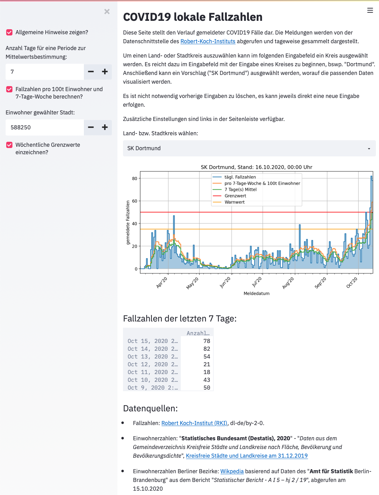

# COVID19-Fallzahlen
Dieses Projekt ist eine [Streamlit-App](https://www.streamlit.io) zur einfachen Visualisierung der Historie von COVID19-Fallzahlen deutscher Land- und Stadtkreise. Die App ist **keine** Informationsquelle, um irgendwelche (z.B. gesundheitliche) Entscheidungen zu treffen, sondern dient lediglich der privaten Erstellung regionaler Fallzahlhistorien, oder als Basis zur Erstellung eigener Skripte. Zur Entscheidungshilfe im Umgang mit der aktuellen Situation sollten Experteneinschätzungen lokaler Gesundheitsinstitutionen genutzt werden (z.B. aus der [Übersicht vom Robert-Koch-Institut](https://www.rki.de/DE/Content/InfAZ/N/Neuartiges_Coronavirus/nCoV.html)).

Es werden Fallzahlen vom Robert-Koch-Institut abgerufen und für einen ausgewählten Kreis dargestellt. Zudem werden aktuell zwei Kennzahlen mit geplottet:
1. Der arithmetische Mittelwert eines selbstgewählten Zeitraums, z.B. einer Woche.
2. Die Anzahl der Fälle eines Kreises pro Woche und 100 000 Einwohner.

## Nutzung

Die App kann direkt über Share Streamlit gestartet werden. Dazu genügt ein Klick auf den "Open in Streamlit"-Button oberhalb des README Textes.

Für die Nutzung wird Python in Verbindung mit verschiedenen Bibliotheken (insbesondere der `streamlit` Bibliothek benötigt). Weitere Anforderungen sind der `requirements.txt` zu entnehmen.

1. Benötigte Bibliothekten installieren: `pip install -r requirements.txt`
2. Streamlit App starten: `streamlit run app.py`
3. Den Anweisungen im Terminal folgen und (bei Standardeinstellungen) `localhost:8501` im Browser aufrufen, um die App zu öffnen.
4. Zum Beenden im Terminal `Strg+C` eingeben und bestätigen.

Die Periodizität des Zeitraumes für die Mittelwerterstellung, sowie die Einwohnerzahl (bei Auswahl der Option *Fallzahlen pro 100t Einwohner und Woche berechnen?*) kann in der Seitenleiste (links) angepasst werden.

Für die meisten Kreise, für die vom Robert-Koch-Institut Fallzahlen vorliegen, sind auch Einwohnerzahlen hinterlegt. Ist dies nicht der Fall wird eine Einwohnerzahl von 100 000 angenommen, welche in den Optionen der Seitenleiste (links) angepasst werden kann.

Tipp:
Der aktuell eingetragene Kreis muss nicht erst gelöscht werden, es kann direkt z.B. "Hannover" eingetragen,
und anschließend "Region Hannover" in den Vorschlägen ausgewählt werden.

## Disclaimer

Der Author hat keinen medizinischen Hintergrund und kennt sich nicht mit Virologie aus. Dieses Projekt dient lediglich der reinen Visualisierung gemeldeter Fallzahlen und etwaiger Kennzahlen aus Eigeninteresse. Eine öffentliche Bereitstellung wurde gewählt, um anderen mit gleichem Interesse potenzielle Arbeit bei der Nutzung des APIs des Robert-Koch-Institutes zu ersparen, oder einen einfachen Einstieg für eigene Visualisierungen zu geben.

## Datenquellen

- Fallzahlen: [Robert Koch-Institut (RKI)](https://npgeo-corona-npgeo-de.hub.arcgis.com/datasets/dd4580c810204019a7b8eb3e0b329dd6_0/data), dl-de/by-2-0, werden live abgerufen.
- Einwohnerzahlen: "**Statistisches Bundesamt (Destatis), 2020**" - "*Daten aus dem Gemeindeverzeichnis Kreisfreie Städte und Landkreise nach Fläche, Bevölkerung und Bevölkerungsdichte*", [Kreisfreie Städte und Landkreise am 31.12.2019](https://www.destatis.de/DE/Themen/Laender-Regionen/Regionales/Gemeindeverzeichnis/Administrativ/04-kreise.html), liegen unter `data/04-kreise.xlsx` vor.
- Einwohnerzahlen Berliner Bezirke: [Wikpedia](https://de.wikipedia.org/wiki/Berlin#Stadtgliederung) basierend auf Daten des "**Amt für Statistik** Berlin-Brandenburg" aus dem Bericht "*Statistischer Bericht - A I 5 – hj 2 / 19*", abgerufen am 15.10.2020, liegen unter `data/Berlin.csv` vor.

# 🇬🇧 English
This project is a [streamlit app](https://www.streamlit.io) to visualize historical COVID19 case numbers for German regions. Case numbers are taken from the [Robert-Koch-Institut](), for more information check out the data sources section down below. This app is **not** suited for basing any kind of decision on it, please refer to professionally prepared data sources by your local health institute.

It includes average values for self-selected periods (e.g. weekly averages) or optional cases per 100k citizens of a city per (7-day) week. The latter is currently used in Germany to decide if more strict measures have to be taken. Therefore a warning is issued when more than 35 cases per 100k per week are reached, and if 50 is crossed, new measures have to be imposed. These border values can also be enabled in the app.

Note: The app is mainly focused on a German audience, hence the code is documented in German as well.

## Usage
You can directly start this app in Share Streamlit via a press on the "Open in Streamlit" button at the beginning of this docu.

This app is python based and requires certain libs (see `requirements.txt`).

1. Install requirements: `pip install -r requirements.txt`
2. Start streamlit app: `streamlit run app.py`
3. Open up the app in your browser by navigating to `localhost:8501` (for default settings).
4. To quit the app, enter `ctrl + c` in your terminal.

The periodicity can be selected in the sidebar of the app. There you'll also find settings e.g. for the number of citizens of a selected city. This value will be pre-filled, except the selected region doesn't match any region in the data files used for the number of citizens. For that case 100k citizens is the default value.

## Disclaimer
The author has no medical background nor is he a virologist. This project is purely made for creating a simple visualization of reported case numbers per region out of personal interest. It is shared publically to potentially save someone else a bit of time, if something similar should be created, e.g. profitting from sample code using the data API from the Robert-Koch-Institut.

## Data Sources

- Case Numbers: [Robert Koch-Institut (RKI)](https://npgeo-corona-npgeo-de.hub.arcgis.com/datasets/dd4580c810204019a7b8eb3e0b329dd6_0/data), dl-de/by-2-0, accessed live via the linked API.
- Number of citizens: "**Statistisches Bundesamt (Destatis), 2020**" - "*Daten aus dem Gemeindeverzeichnis Kreisfreie Städte und Landkreise nach Fläche, Bevölkerung und Bevölkerungsdichte*", [Kreisfreie Städte und Landkreise am 31.12.2019](https://www.destatis.de/DE/Themen/Laender-Regionen/Regionales/Gemeindeverzeichnis/Administrativ/04-kreise.html), stored in `data/04-kreise.xlsx`.
- Number of citizens for regions in Berlin: [Wikpedia](https://de.wikipedia.org/wiki/Berlin#Stadtgliederung) based on data from the report "*Statistischer Bericht - A I 5 – hj 2 / 19*" by "**Amt für Statistik** Berlin-Brandenburg", accessed on 15.10.2020, stored in `data/Berlin.csv`.
